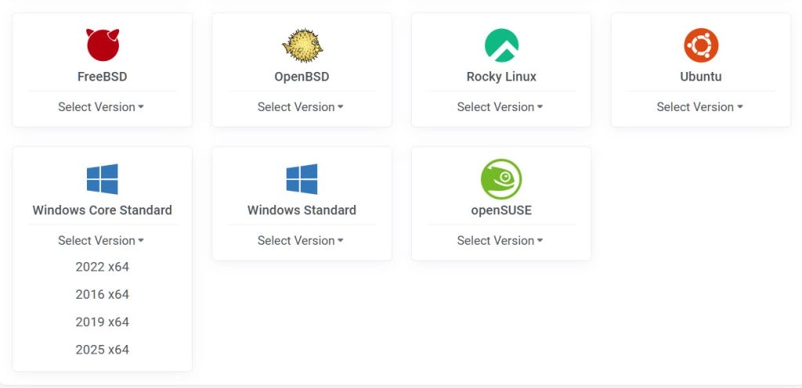
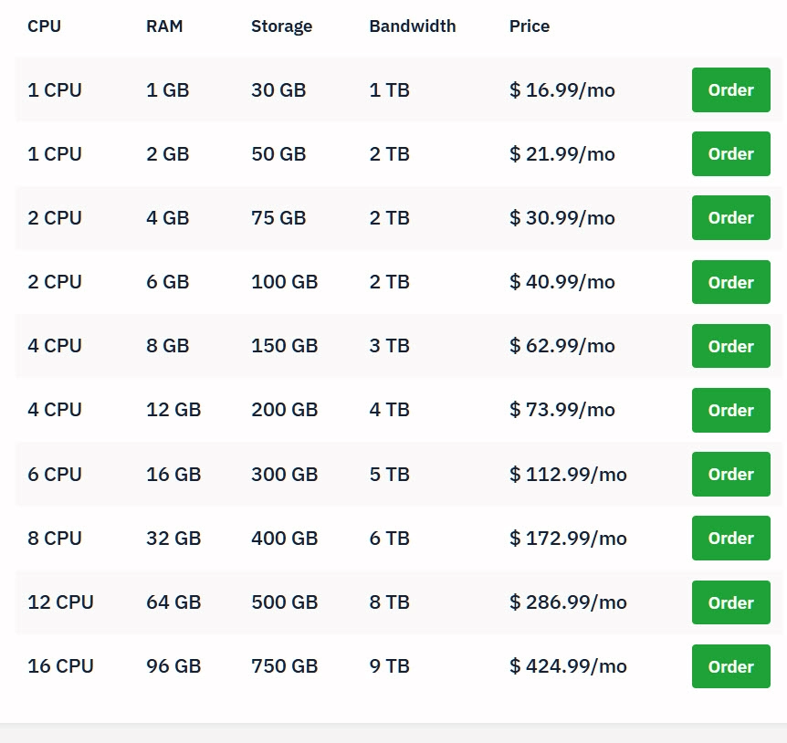

# Windows VPS 全面指南：用途、选购指标、价格区间与安全加固

---

你想在云上跑个Windows服务器，但不知道从哪开始？或者你已经有了Linux VPS，现在想试试Windows？这篇文章用人话把Windows VPS的来龙去脉讲清楚——什么情况下需要它、怎么选、多少钱、怎么不被黑。

---

## 什么是 Windows VPS？

Windows VPS就是在一台大服务器上切出来的独立小空间，预装了Windows Server。你可以通过远程桌面（RDP）直接操作，就像在自己电脑上用Windows一样。

和共享虚拟主机比，它给你完整的管理员权限、独立的CPU和内存；和独立服务器比，它便宜、按月付、随时能升配。

**适合谁？**

- 你的项目用IIS、.NET、SQL Server或者Active Directory
- 你需要图形界面来跑那些只有Windows版本的软件
- 你想要个云端Windows盒子，随时远程连上去干活

**不适合谁？**

- 静态网站、容器化微服务——Linux更便宜更省事
- 超高并发、极低延迟的核心系统——得上独立服务器或公有云专业方案

## 选购时看什么

**许可证怎么算钱**  
有的商家把Windows许可打包在月费里，有的按vCPU或小时单独收费。长期用就选"含许可"的月付套餐；短期实验就按小时算。

**CPU别只看核数**  
同样是1核，不同商家的CPU代际差很多。.NET和IIS更吃单核性能，别被总核数迷惑。

**存储类型**  
优先NVMe。如果你要跑数据库或写日志频繁，关注IOPS和有没有性能包可加。

**带宽和流量**  
搞清楚是共享带宽还是独享、有没有限速、月流量封不封顶。上传带宽也很重要——备份和推流都靠它。

**地理位置**  
就近选机房。频繁跨境访问要测一下丢包和延迟。

**虚拟化和附加功能**  
KVM还是Hyper-V、有没有快照、备份、防火墙、DDoS防护——这些都影响你的使用体验和总成本。

## 价格区间

- **入门学习/轻量桌面**：$8–20/月
- **中小业务/网站API**：$15–40/月
- **持续计算/大存储**：$25–80+/月

隐藏成本常见于：Windows许可、自动备份、快照容量、额外IPv4、带宽超量、控制面板和SQL Server商业版授权。

## 推荐配置

**远程桌面/报表工具**  
2核/4–8GB内存/60–100GB NVMe，带宽≥100Mbps

**IIS网站/.NET API**  
2核/4–8GB/80–120GB，开启应用程序池回收和日志分割

**轻量数据库/定时任务**  
2–4核/8–16GB/NVMe，数据盘和系统盘分开

**自动化爬取/转码**  
看重单核和磁盘I/O；任务峰值多就加内存缓冲

## Windows版本怎么选

**Windows Server 2022**：长期支持、驱动兼容广，优先选它  
**Windows Server 2019**：生态成熟、和旧软件兼容好

避免来历不明的镜像。用商家官方镜像，自动激活和更新最省心。

## 安全加固清单（开箱就做）

**RDP**  
改默认3389端口、只放行白名单IP、启用NLA、强密码+双因素认证

**账户**  
禁用内置Administrator的远程登录，新建管理员账户并最小权限分层

**防火墙**  
只开必须的端口；面向公网的IIS配置WAF或反向代理

**系统基线**  
关闭SMBv1、开启自动更新、限制PowerShell执行策略、启用Windows Defender

**备份**  
系统盘和数据盘分离，定期快照+异地备份，至少演练一次恢复

**审计**  
登录失败告警、Windows事件转存到对象存储或日志平台

## 性能优化要点

**磁盘**  
IIS日志、Temp和数据库文件放数据盘；开启磁盘写入缓存并确保断电保护策略

**内存与进程**  
为常驻服务设置固定最小工作集，避免频繁换页；关闭不必要的开机自启

**网络**  
开启HTTP/2和压缩，IIS日志按天或按大小切割，结合CDN做静态资源卸载

**RDP体验**  
客户端禁用桌面特效和字体平滑，弱网下显著改善

## 部署流程

1. 选择含Windows的套餐，勾选自动备份/快照
2. 首次启动后更改RDP端口、创建新管理员、配置防火墙和NTP
3. 通过RDP登录，安装IIS/.NET Hosting Bundle/Web Deploy
4. 上传站点并配置TLS证书，开启自动续期
5. 配置监控和告警（CPU、内存、磁盘、端口与HTTP健康检查）

## 迁移策略

**网站与应用**  
用Web Deploy或CI/CD（压缩制品+PowerShell脚本）一键发布

**数据库**  
SQL Server备份/还原或Log Shipping；小型站用SQL Express

**文件与用户**  
`robocopy`增量同步；域环境用Active Directory子域或单向信任逐步迁移

**DNS**  
降低TTL，窗口内切换到新IP并准备好回滚预案

## 常见问题

**Q：能多用户同时远程吗？**  
A：并发图形会话需要RDS CAL许可。普通VPS自带的是单用户桌面体验，超出需合规授权或改造为远程应用发布。

**Q：如何避免被暴力破解？**  
A：端口更换+IP白名单+NLA+2FA是组合拳，配合云防火墙和入侵告警。

**Q：选多核还是高主频？**  
A：IIS/.NET多为轻计算+I/O绑定，优先高单核，队列型任务再横向扩。

**Q：带宽怎么估算？**  
A：月均带宽≈（日PV×平均页面体积×30）/（30天×86400秒）。视频/备份场景关注上行。

**Q：IPv4必要吗？**  
A：多数业务仍需公网IPv4；如可在反向代理/CDN后，可只要私网+出口网关以降成本。

## 术语速查

**RDP**：远程桌面协议  
**IIS**：Windows原生Web服务器  
**CAL**：客户端访问许可  
**IOPS**：每秒输入输出次数，衡量磁盘性能  
**NLA**：网络级别身份验证，RDP的加固选项

## Windows VPS推荐清单

### Vultr（预装Windows，全球节点）

Vultr提供现成的Windows Server镜像，基础费和许可证费分开显示，方便比价。适合要快速开机、全球就近、按小时计费的人。

**产品形态**  
在Vultr的Cloud Compute上直接选择Windows Server公共镜像（自动激活），创建时即可一键部署，支持按小时或按月计费。

**镜像版本**  
Windows Server 2025/2022/2019/2016（以下单页为准）

**授权计费**  
Windows许可证不包含在实例基础价内，创建时会单独显示并叠加到总价（小时计费会折算到月价）

**规格与价格**  
从1核起，多档内存/存储/带宽可选；不同区域可用档位略有差异，以定价页和下单页为准

**全球区域**  
覆盖多大洲，就近部署、快速开机，无长期合约

#### 适用场景

**远程桌面（RDP）与办公软件**  
原生RDP，适合需要GUI的客户端工具与日常桌面

**IIS/.NET应用与API**  
托管ASP.NET、IIS站点、Windows上的任务与服务

如果你想尝试在全球多个数据中心快速部署Windows环境，Vultr的按小时计费模式让你可以随开随关，不用担心长期合约的束缚。👉 [立即体验Vultr的Windows VPS，按小时灵活计费](https://www.vultr.com/?ref=9738262-9J)

**行业/遗留软件**  
仅有Windows版本的财务、报表、ODBC网关等集中托管

#### 开通与部署流程

**1. 创建实例**  
选择Cloud Compute → 镜像选Windows Server（版本任选） → 在页面确认"基础价+许可价"

**2. 首次登录**  
在控制台查看临时密码，用RDP客户端连接；修改计算机名、时区，开启更新

**3. 安全加固**  
更改默认3389端口、启用NLA、仅放行白名单IP；结合Vultr防火墙与告警

**4. 应用安装**  
IIS/.NET Hosting Bundle/Web Deploy/证书与计划任务

**5. 备份回滚**  
启用快照或备份存储，变更前先拍快照，故障可一键回滚

#### 网络与带宽

**免费带宽额度**  
按账户与实例计划共同计算当月上限，超量按$0.01/GB计费；建议设置告警

**跨区差异**  
不同区域的价格、可用规格与网络质量会有差异，就近选区降低RDP与API时延

#### 进阶功能

**自定义ISO**  
上传/挂载ISO进行特殊安装或维护（遵循软件许可）

**自动化**  
用户数据/脚本初始化；Windows端可结合计划任务、PowerShell

#### 费用构成

实例基础价+Windows许可价+快照/备份存储+可能的带宽超量费+额外IPv4（如需）。下单前在定价与创建页核对总月价，并设置用量告警。

#### 选型与性能提示

**优先高单核**  
IIS/.NET多为I/O绑定且偏爱单核性能，别只看总核数

**磁盘IOPS**  
优先NVMe；把日志、Temp、数据库文件放在数据盘

**就近选区**  
面向用户与团队的位置选择最近区域

**合规镜像**  
使用官方Windows镜像，自动授权与更新最省心

### Hostwinds（老牌提供商，支持托管与自管）

Hostwinds提供Windows VPS，可选托管/非托管两种模式，入门价清晰；适合想省事（托管）或自己折腾（非托管）的用户。

**产品形态**  
Hostwinds提供Windows VPS的两类托管方式——自管（Unmanaged）与托管（Managed）。两者硬件规格相同，区别在于是否由官方代管系统与常见服务（补丁、监控、迁移、面板等）。下单时选择Windows Server镜像后即可一键部署，支持通过RDP连接。

**镜像与授权**  
提供常见的Windows Server版本（以下单页为准），使用官方镜像自动激活。Windows许可证费用通常与方案绑定或以附加项体现，最终价格以结算页为准。

**规格与扩展**  
从1核起，多档内存与SSD容量可选，支持升级到更高配置。可添加额外IPv4、快照/备份存储与监控告警等增值项。

**网络与带宽**  
按方案提供带宽与月度流量配额，支持按需提升。就近选择数据中心可降低RDP与站点访问时延。

**数据中心**  
覆盖北美多地与欧洲若干机房（以下单页显示为准），可结合业务受众与合规要求选区。

#### 自管vs托管怎么选

**自管（Unmanaged）**  
适合有Windows维护经验、追求预算可控的人。你负责系统更新、安全加固、服务安装与故障排查。

**托管（Managed）**  
适合希望"开箱即用"的团队。Hostwinds负责日常运维与监控，遇到问题可直接提交工单处理，减少停机与精力投入。

#### 典型使用场景

**远程桌面与办公**  
原生RDP，集中托管仅有Windows版本的软件（报表工具、可视化抓取、专有客户端等）

**IIS/.NET托管**  
部署ASP.NET Core/IIS站点与API，利用Windows生态（IIS、WMI、ODBC、Active Directory对接）

**小型数据库与任务**  
承载SQL Server Express、计划任务、文件分发与ODBC网关

**行业/遗留系统**  
仅发布Windows版的商业软件、财务与ERP客户端集中上云

#### 开通与部署要点

**下单**  
在Hostwinds选择Windows VPS → 选托管方式 → 选配置与数据中心 → 勾选Windows镜像与所需附加项

**首次登录**  
控制台查看RDP信息与密码，用本地远程桌面客户端连接；更改管理员密码、计算机名与时区

**安全加固**  
修改3389端口、启用NLA、只允许白名单IP；开启Windows防火墙与Hostwinds侧的告警/监控

**备份与回滚**  
启用快照或自动备份；每次更改前先拍快照，故障时一键回滚

**运维**  
托管版由官方代管补丁/服务；自管版建议使用PowerShell脚本与任务计划器统一初始化与巡检

#### 选型与配置建议

**远程桌面**  
2核/4–8GB/60–100GB SSD，弱网环境在客户端关闭特效与字体平滑

**IIS/.NET**  
2核/4–8GB/80–120GB，按天切割日志、启用HTTP/2与压缩

**数据库/任务**  
2–4核/8–16GB/NVMe优先，系统盘与数据盘分离

**性能侧重点**  
IIS/.NET更吃单核性能与磁盘IOPS；优先高主频与NVMe，别只看总核数

**费用构成**  
实例基础价+Windows许可（若独立计费）+备份/快照存储+额外IPv4+可能的流量超额费；以结算页"到手价"为准

#### 常见问题

**托管能省到什么？**  
托管版会协助处理系统更新、故障排查、迁移与常见服务配置，适合不想投入太多时间的团队。

**能否多用户图形会话？**  
并发图形会话需遵循RDS CAL授权；普通VPS默认仅单用户桌面体验。

**怎么避免被扫与暴力破解？**  
端口更换+IP白名单+NLA+强口令与2FA+日志告警的组合拳。

**是否支持自定义需求？**  
可添加额外IP、备份容量、监控与安全增强；更多细节以下单页与工单回复为准。

### Amazon Lightsail（入门简单，套餐定价）

Amazon Lightsail的Windows套餐$9.50/月起，支持90天试用（指定套餐），适合个人与小团队做RDP、.NET或后台小服务，控制台非常易上手。

### Kamatera（弹性最强，按小时/分钟计费）

Kamatera可自定义vCPU、内存、磁盘与网络，小时或月度计费都行，支持Windows Server镜像，适合需要临时扩容/缩容和多地区部署的用户。

### OVHcloud（欧洲优选，带宽足，提供Windows选项）

OVHCloud VPS提供预装Windows版本；如果转到公有云实例，Windows许可按每vCore每小时计费，适合在欧盟合规场景或需要高性价比大带宽。

### Contabo（总价便宜，存储大）

Contabo VPS套餐价格低、磁盘给得多，Windows许可证常见为月度加价；适合长周期跑业务、对单核性能不是特别极限但追求容量与带宽的人。

### 选型要点

**许可证计费**  
有的按方案固定加价（如Contabo），有的按vCore/小时（如OVH公有云），还有的把套餐价里含Windows（Lightsail）。合规使用官方镜像更稳，避免BYOL带来的激活与授权风险。

**计费粒度**  
需要短期弹性实验就选小时计费（Vultr、Kamatera）；长期稳定业务更偏向月付（Contabo、Lightsail）。

**网络与地域**  
就近选区；对欧洲访问或合规敏感选OVHcloud，对全球分布与低门槛选Vultr/Kamatera/Lightsail。

**托管与自管**  
不想维护安全更新与备份，选托管（Hostwinds可选托管）；有经验、要省钱，选自管。

### 规格建议（常见用法）

**远程办公/RDP桌面**  
2核/4GB内存/60–80GB SSD，优先选带预装Windows与固定月价的方案（如Lightsail、Vultr）

**.NET Core/后台小服务**  
1–2核/2–4GB内存/40–80GB SSD，流量看业务；要随开随关就用Kamatera或Vultr

**长时间跑任务/存储更大**  
2核/4–8GB/大盘（200GB+），看重总价就看Contabo

### 安全与运维小贴士

**远程桌面**  
改默认3389端口、限制防火墙源IP、开启网络层防护，并启用强口令+双因素

**备份与快照**  
Hostwinds有低价备份附加项；Vultr/Kamatera支持快照/镜像，出故障能快速回滚

**版本选择**  
优先Windows Server 2019/2022，生态成熟、兼容好，且供应商镜像自带自动激活

## 一台Windows VPS有什么用？

### 典型场景

**远程办公与日常桌面**  
通过原生的远程桌面（RDP）登录，跑只在Windows下可用的GUI工具（PS/AI批处理器、爬虫可视化、报表工具等），随开随用、断线不关机。

**Windows技术栈应用**  
部署基于.NET、ASP.NET、IIS的网站/API，或承载需要COM、ODBC、WMI等Windows特性的服务。

**企业内管与实验室**  
练习/演示Active Directory、域控/组策略、RADIUS、证书服务、WSUS等；做考试环境、课程实验。

**专有/行业软件托管**  
仅提供Windows版本的管理端、驱动型中间件、旧版财务/进销存客户端、报表生成器等，集中托管，远程多人使用。

**自动化与常驻任务**  
计划任务、Powershell作业、Office宏生成报表、定时抓取/转换文件；配合OneDrive/SharePoint做自动归档。

**轻量数据库/报表**  
小型的SQL Server Express、Access程序、ODBC网关，把内部数据以只读接口形式暴露给外部服务。

**跨平台兼容**  
你在macOS/Linux，本地没有Windows环境；用VPS当"云端Windows盒子"跑一次性软件或转码。

### 什么时候选Windows（而不是Linux）

- 需要图形界面和外设驱动、或必须用到IIS/COM/ODBC/.NET Framework之类的Windows专属能力
- 依赖Active Directory/组策略的企业内管场景
- 团队已经有Windows维护经验与脚本资产（Powershell、组策略模板）
- 软件厂商明确只支持Windows服务器

### 规格与选型建议

**远程桌面/办公**  
2核/4–8GB内存/60–100GB SSD；并发用户多时加内存与磁盘IOPS

**IIS网站/API**  
2核/4–8GB/60–120GB；启用应用程序池回收与日志分割

**轻量数据库/任务**  
2–4核/8–16GB/NVMe优先；注意备份与数据盘分离

**网络**  
带宽≥100Mbps；需要上传/视频推流选更高上行或独享带宽

### 安全与合规清单

**RDP加固**  
改默认3389端口、仅允许白名单IP、开启NLA、强口令+2FA、关闭空会话

**系统基线**  
及时更新、关闭SMBv1、最小化安装、只开放必须的入站端口

**权限与审计**  
最小权限原则、分类账户（管理员/普通）、开启登录失败告警与日志转存

**备份与快照**  
系统盘与数据盘分开；定期快照+异地备份，演练恢复

**授权**  
多人同时远程会话需符合远程桌面服务（RDS）CAL要求；商业软件（如Office、数据库）按许可条款部署

### 常见坑

**低配即卡**  
2GB内存跑GUI几乎没法用；磁盘IOPS低会导致"点一下卡半天"

**被扫与暴力破解**  
公网RDP必做IP限制/端口转发/跳板机，不要裸奔

**许可证计费**  
很多商家Windows要额外付费；按小时/按vCPU计费模型不同，总价差很大

**"野生镜像"风险**  
来历不明的系统镜像可能带后门或无法激活，务必使用官方或商家镜像

---

## 结语

Windows VPS适合需要Windows技术栈、图形界面或特定行业软件的场景。选购时重点看许可证计费模式、单核性能、存储IOPS和网络质量。安全加固和定期备份是开箱第一件事——改RDP端口、限制IP、启用NLA、定期快照。

如果你需要全球节点、按小时灵活计费、预装Windows Server且自动激活的方案，👉 [Vultr的Windows VPS是个省心的选择](https://www.vultr.com/?ref=9738262-9J)——基础价和许可价分开显示，价格透明，支持快照回滚，适合从入门到生产的各种场景。
